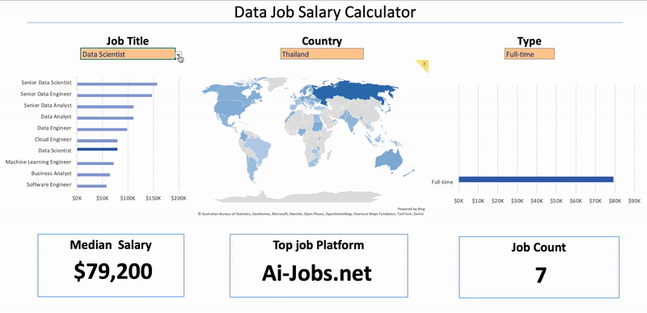
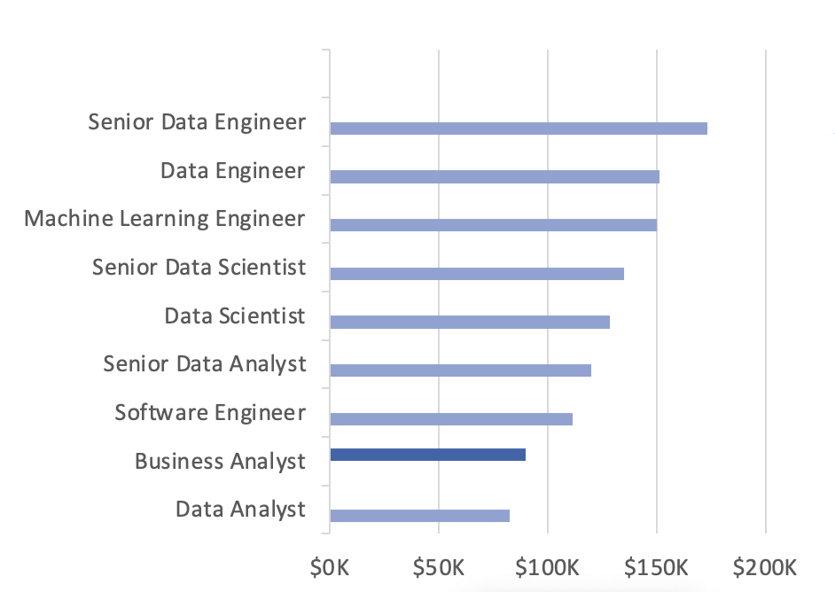
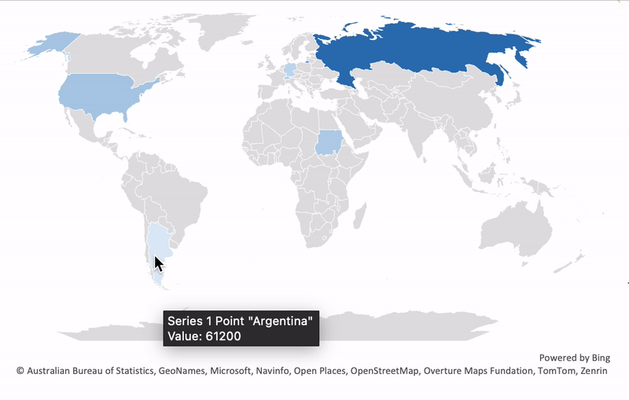
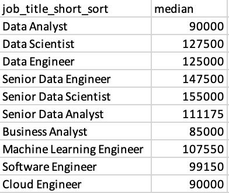
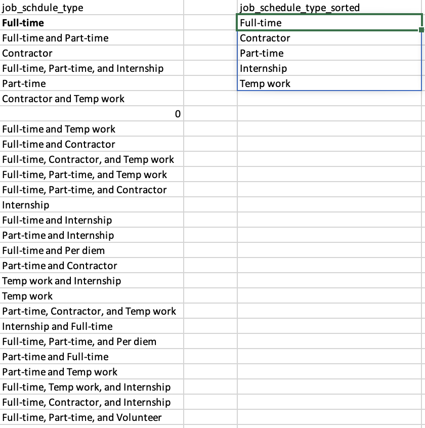
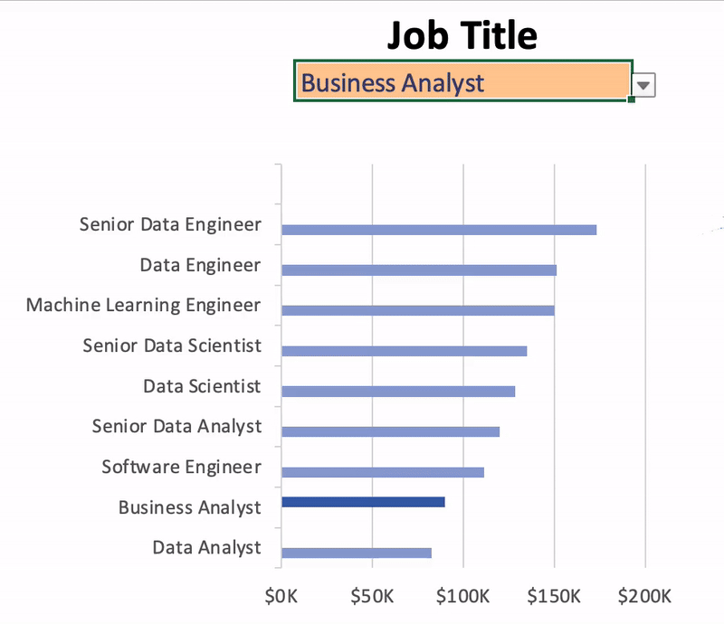

# Excel Salary DashBoard



## Introduction

The purpose of this dashboard is to display the quantity of data-related jobs, job types, median salaries, and job locations posted on the platform. It aims to assist job seekers in making informed decisions about their career goals.

The data used for this project was sourced from the YouTube channel[LukeBarousse](https://www.youtube.com/@LukeBarousse)

The final dashboard is available in [data_jobs_dashboard.xlsx](data_jobs_dashboard.xlsx).

### Excel Skills Used

The following Excel skills were utilized for analysis:

- Charts
- Formulas and Functions
- Data Validation

## DashBoard Build

### Data job salaries chart.



- **Feature** : The median salary of each job is used to compare them with one another. The selected job will be highlighted with a darker shade. Salaries are sorted in descending order for easier readability.
- **Insights Gained** : It seems that Engineering and Scientist roles tend to have higher salaries compared to Analyst roles.

### Map Chart.



- **Feature** : This chart displays the median salaries of the selected jobs on a world map. The darker the shade of blue, the higher the salary compared to lighter shades of blue.

- **Insights Gained** : It show roughly salary trend in each regions

## Functions and Formulas

### Median Salary by Job Titles

```
=MEDIAN(
IF(
    (jobs[job_title_short]=A2)*
    (jobs[job_country]=country)*
    (ISNUMBER(SEARCH(type,jobs[job_schedule_type])))*
    (jobs[salary_year_avg]<>0),
    jobs[salary_year_avg]
)
)
```

- **Multi-Criteria Filtering** : Checks job title, country, schedule type, and excludes blank salaries.

- **Formula Purpose** : This formula will find the median that match with job title, country, schedule type we input and create table below that we use it to crate Data job salaries chart.



### Categorize job type function

```
=FILTER(J2#,NOT(ISNUMBER(SEARCH("and",J2#)))*(J2#<>0))
```

- As you can see in table below, the column 'Job_schedule_type' contains raw data. We aim to categorize this raw data into the format shown in the 'Job_schedule_type_sorted' column to make it easier to analyze and count.



## Data Validation



### Filtered List

- This dashboard uses restricted input through filtered lists as data validation for Job Title, Country, and Type fields to prevent undesired results and maintain data accuracy.

## Conclusion

This dashboard was created to provide information about salaries, locations, and job types from 2023, helping job seekers observe trends in data-related jobs. It aims to assist job seekers in making informed decisions about their future career paths.
